<div align="center">

# 🖼️ CIFAR-10 CNN Image Classifier

**Teaching a machine to see — a clean, fully-documented Convolutional Neural Network that sorts tiny photos into 10 categories.**

[](https://huggingface.co/spaces/prithugging/cifar10-cnn-classifier)

[](https://www.python.org/)
[](https://www.tensorflow.org/)
[](https://keras.io/)
[](https://www.gradio.app/)
[](https://huggingface.co/spaces/prithugging/cifar10-cnn-classifier)
[](#-results)
[](LICENSE)

**[👉 Try the live app](https://huggingface.co/spaces/prithugging/cifar10-cnn-classifier)** — drag in a photo and watch it predict.

</div>

---

## 🎯 Mission

Most deep-learning examples hand you a black box. This project does the
opposite: it is a **small, honest, end-to-end image classifier where every
design decision is explained** — readable code, a measurable baseline, and a
clear path from a naïve model to a stronger one. The goal is not just a
classifier, but a transparent reference you can read, run, and extend.

It classifies 32×32 colour images into **10 classes**:

`airplane` · `automobile` · `bird` · `cat` · `deer` · `dog` · `frog` · `horse` · `ship` · `truck`

---

## ✨ Highlights

- 🧱 **3-block CNN** built with the clean Keras `Sequential` API
- 📝 **Every block commented** — written to be read, not just run
- 🔁 **Two trainers**: a baseline (`train.py`) and an augmented, higher-accuracy version (`train_augmented.py`)
- 🎛️ **Data augmentation** (flip / rotate / zoom) that measurably improves the hardest classes
- 🔮 **One-command prediction** on any image, with top-3 guesses and confidence
- 📦 **Trained models included** — predict immediately, no training required

---

## 🚀 Quickstart

```bash
# 1. Clone and enter
git clone https://github.com/pritmon/cifar10-cnn-classifier.git
cd cifar10-cnn-classifier

# 2. Set up an isolated environment
python -m venv venv
source venv/bin/activate          # Windows: venv\Scripts\activate
pip install -r requirements.txt

# 3. Predict right away (a trained model ships with the repo)
python predict.py sample_images/ship.png
```

Example output:

```
Predicted class: ship
Confidence: 97.41%

Top 3 guesses:
  1. ship         97.41%
  2. automobile    2.59%
  3. airplane      0.00%
```

Want to train from scratch instead? → `python train.py`

---

## 🧠 How it works

Think of the model as a photo-sorting machine with **three detectives**. The
photo passes through each one: the first spots tiny details (edges), the next
builds those into shapes, the last into whole parts (ears, wheels). After each
detective the picture is shrunk a little, so the next one sees the *big picture*
instead of single dots. Finally the machine weighs up all the clues and drops
the photo into one of 10 buckets.

```mermaid
flowchart TD
    IN(["🖼️ A tiny photo goes in<br/><i>32×32 pixels · 3 colour channels</i>"]):::io
    NORM["🔢 Turn the picture into numbers the computer can read<br/><i>each pixel ÷ 255 → range 0–1</i>"]:::prep

    C1["🔍 Detective 1 — spots edges and colours<br/><i>Conv2D · 32 filters + ReLU</i>"]:::conv
    P1["🔻 Shrink to see the bigger picture<br/><i>MaxPool · 32×32 → 16×16</i>"]:::pool
    C2["🔍 Detective 2 — spots simple shapes<br/><i>Conv2D · 64 filters + ReLU</i>"]:::conv
    P2["🔻 Shrink it again<br/><i>MaxPool · 16×16 → 8×8</i>"]:::pool
    C3["🔍 Detective 3 — spots parts like ears, wheels, wings<br/><i>Conv2D · 128 filters + ReLU</i>"]:::conv
    P3["🔻 Shrink it once more<br/><i>MaxPool · 8×8 → 4×4</i>"]:::pool

    FL["📋 Gather every clue into one list<br/><i>Flatten · 4×4×128 → 2048 numbers</i>"]:::head
    D1["🧠 Weigh up all the clues<br/><i>Dense · 128 neurons + ReLU</i>"]:::head
    DR["🎲 Hide some clues so it can't just memorise<br/><i>Dropout · 30%</i>"]:::drop
    SM["🪣 Sort the photo into 1 of 10 buckets<br/><i>Dense 10 + Softmax → probabilities</i>"]:::io
    RES(["🐱 It's a cat! — 87% sure<br/><i>highest probability wins</i>"]):::result

    IN --> NORM --> C1 --> P1 --> C2 --> P2 --> C3 --> P3 --> FL --> D1 --> DR --> SM --> RES

    classDef io fill:#1E88E5,stroke:#0D47A1,color:#ffffff
    classDef prep fill:#00897B,stroke:#00695C,color:#ffffff
    classDef conv fill:#43A047,stroke:#2E7D32,color:#ffffff
    classDef pool fill:#7CB342,stroke:#558B2F,color:#ffffff
    classDef head fill:#8E24AA,stroke:#6A1B9A,color:#ffffff
    classDef drop fill:#FB8C00,stroke:#EF6C00,color:#ffffff
    classDef result fill:#E53935,stroke:#B71C1C,color:#ffffff
```



Each box reads top-to-bottom: the **plain-English step** first, the **real layer
name and numbers** in italics underneath — so a curious reader and a developer
both get what they need from the same picture.

---

## 📊 Results

| Model | Training | Test accuracy | Notes |
|-------|----------|:---:|-------|
| `cifar10_model.keras` | 15 epochs | **74.4%** | Strong baseline, but overfits the training data |
| `cifar10_model_augmented.keras` | 55 epochs + augmentation | **75.4%** | Learns honestly; far stronger on confusable classes |

**The augmentation win, made concrete** — on a sample `cat` image, model
confidence in the correct class climbed dramatically as augmentation and
training were added:

```
cat confidence:   3.9%  →  34.1%  →  68.7%   (finally the #1 prediction)
```

> CIFAR-10's `cat` vs `dog` is famously the hardest pair to separate at 32×32.
> Closing that gap is exactly where data augmentation pays off most.

---

## 🛠️ The augmented model

`train_augmented.py` adds three augmentation layers at the front of the network:

```python
layers.RandomFlip("horizontal")   # mirror left–right
layers.RandomRotation(0.1)        # tilt slightly
layers.RandomZoom(0.1)            # zoom in / out
```

These randomly perturb every image *during training only*, so the model never
sees the same picture twice — forcing it to learn the underlying object instead
of memorising specific photos.

```bash
python train_augmented.py
# then predict with the augmented model:
python predict.py sample_images/cat.png model/cifar10_model_augmented.keras
```

---

## 🧰 Tech stack — what's used and why

Every tool here was picked for a specific reason. Plain-English explanations below.

### 📚 Languages & libraries

<div align="center">


</div>

| Tool | What it is | Why it's used (easy English) |
|------|-----------|------------------------------|
| 🐍 **Python 3** | The programming language | The standard language for AI — simple to read and has every ML library. |
| 🔶 **TensorFlow 2** | The deep-learning engine | Does all the heavy training math for us. We just describe the model; it runs the millions of calculations. |
| 🔴 **Keras** (inside TensorFlow) | A friendly layer on top of TensorFlow | Lets us build the network by stacking layers like LEGO, instead of writing raw math. |
| 🔵 **NumPy** | Fast number/array maths | Used in `predict.py` to handle the image as a grid of numbers and to pick the winning class. |
| 🟠 **Gradio** | Turns the model into a web app | A few lines of Python give a drag-and-drop web page — no HTML/CSS/JS needed. |
| 🤗 **Hugging Face Spaces** | Free hosting for the live app | Runs the web app online 24/7 and gives a public link anyone can use. |
| 🖼️ **Pillow (PIL)** | Image loading & resizing | Opens your `.jpg`/`.png` file and shrinks it to the 32×32 size the model expects. |

### 🧱 Key Keras building blocks (the layers)

<div align="center">


</div>

| Layer / function | Job | Why we need it |
|------------------|-----|----------------|
| 🟦 `Sequential` | Stacks layers top-to-bottom | The simplest way to build a model — data flows straight through, layer by layer. |
| 🔵 `Conv2D` | Slides a filter over the image to find patterns | The "eyes" of the model — detects edges, then shapes, then object parts. |
| 🟢 `MaxPooling2D` | Shrinks the image, keeping the strongest signal | Makes the model faster and helps it focus on the *big picture*, not exact pixels. |
| ⚪ `Flatten` | Turns the 2D grid into a 1D list | Bridges the image part and the decision part of the network. |
| 🟣 `Dense` | Fully-connected decision layer | Combines all the clues to decide the final answer (10 outputs = 10 classes). |
| 🟠 `Dropout(0.3)` | Randomly ignores 30% of neurons while training | Stops the model from memorising — forces it to learn many backup clues. |
| 🟦 `RandomFlip` / `RandomRotation` / `RandomZoom` | Randomly tweak images during training | Free extra variety so the model learns the real object, not one exact photo. |

### ⚙️ Key functions (the workflow)

<div align="center">

-6E40C9?style=flat-square)
-1A7F37?style=flat-square)
-CF222E?style=flat-square)
-BF8700?style=flat-square)
-0969DA?style=flat-square)
-8250DF?style=flat-square)

</div>

| Function | What it does |
|----------|--------------|
| 🟣 `cifar10.load_data()` | Downloads and loads the 60,000 labelled images. |
| 🟢 `model.compile()` | Sets the optimizer, loss, and metric before training. |
| 🔴 `model.fit()` | The actual training loop — this is what runs for all the epochs. |
| 🟡 `model.evaluate()` | Scores the model on unseen test images (the honest grade). |
| 🔵 `model.save()` / `load_model()` | Saves the trained brain to a file and loads it back later. |
| 🟪 `np.argmax()` | Picks the class with the highest probability as the final answer. |

### 🔢 The math & formulas (the important bits)

<div align="center">


</div>

| Concept | Formula (simple form) | Why it matters |
|---------|----------------------|----------------|
| 🟩 **Pixel normalisation** | `value / 255.0` | Turns pixels (0–255) into small numbers (0–1) so training is stable and fast. |
| 🟧 **ReLU activation** | `f(x) = max(0, x)` | Keeps positive signals, zeroes out negatives — lets the network learn complex, non-straight-line patterns. |
| 🟦 **Softmax** (final layer) | turns raw scores into probabilities that **add up to 1** | So the output reads as "87% cat, 8% dog…" instead of meaningless numbers. |
| 🟥 **Cross-entropy loss** | penalises confident wrong answers heavily | The "wrongness score" the model tries to shrink — being *confidently wrong* is punished most. |
| 🟩 **Adam optimizer** | adaptive gradient descent | The smart method that decides how to nudge all 356,810 weights each step; auto-tunes its own learning rate. |

> 💡 In one line: **Pillow + NumPy** prepare the image → **Keras layers** form the brain →
> **TensorFlow** does the math → **softmax** gives the probabilities → **argmax** picks the winner.

---

## 📁 Project structure

<pre>
cifar10-cnn-classifier/
├── <a href="train.py">train.py</a>                 # baseline trainer (build → train → save)
├── <a href="train_augmented.py">train_augmented.py</a>       # augmented trainer (higher accuracy)
├── <a href="predict.py">predict.py</a>               # load a model, classify any image (CLI)
├── <a href="app.py">app.py</a>                   # Gradio web app (drag-and-drop demo)
├── <a href="make_sample_images.py">make_sample_images.py</a>    # save a few real CIFAR-10 images to test on
├── <a href="model">model/</a>                   # trained models (.keras)
│   ├── <a href="model/cifar10_model.keras">cifar10_model.keras</a>            # baseline
│   └── <a href="model/cifar10_model_augmented.keras">cifar10_model_augmented.keras</a>  # augmented (deployed)
├── <a href="sample_images">sample_images/</a>           # ready-to-use test images
├── <a href="huggingface_space">huggingface_space/</a>       # self-contained bundle deployed to HF Spaces
│   ├── <a href="huggingface_space/app.py">app.py</a>               # flat-path version for the Space
│   ├── <a href="huggingface_space/requirements.txt">requirements.txt</a>     # Space pins (Gradio 5)
│   └── <a href="huggingface_space/README.md">README.md</a>            # Space config + the model &amp; example images
├── <a href="requirements.txt">requirements.txt</a>
├── <a href="LICENSE">LICENSE</a>
└── <a href="README.md">README.md</a>
</pre>

> The `huggingface_space/` folder is a **self-contained deploy bundle** — it
> intentionally carries its own copy of the model and example images so it can
> be uploaded to [Hugging Face Spaces](https://huggingface.co/spaces/prithugging/cifar10-cnn-classifier)
> as-is, with no path juggling.

---

## 🗺️ Roadmap

- [ ] Add `BatchNormalization` and a 4th conv block to push past 80%
- [ ] Fine-tune a pre-trained backbone to handle full-resolution, real-world photos
- [x] Ship a drag-and-drop web demo → **[live on Hugging Face Spaces](https://huggingface.co/spaces/prithugging/cifar10-cnn-classifier)** 🎉

---

## 📄 License

Released under the [MIT License](LICENSE) — free to use, learn from, and build on.

<div align="center">
<sub>A hands-on study of convolutional neural networks — built, measured, and improved. 🐱</sub>
</div>
